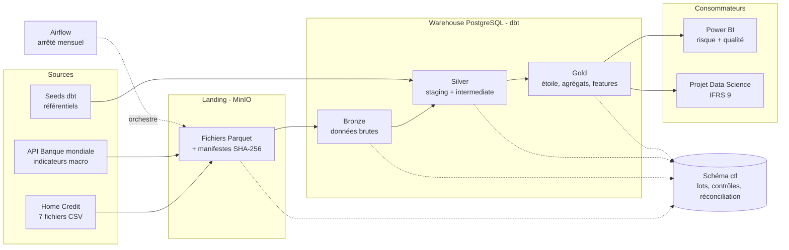

# Architecture de la plateforme

| Version | Date | Modification |
| --- | --- | --- |
| 1.0 | 2026-10-04 | Création |

## Schéma

## Rôle de chaque zone

| Zone | Technologie | Rôle | Règle d'or |
| --- | --- | --- | --- |
| Sources | CSV, API REST, seeds | Systèmes de la banque (simulés) et référentiels | La plateforme ne modifie jamais une source |
| Landing | MinIO | Copie exacte des fichiers reçus, conservée pour l'audit | Immuable : on ajoute, on n'efface jamais |
| Bronze | Schéma `bronze` | Données chargées telles quelles + colonnes techniques | Aucune règle métier |
| Silver | Schémas `staging`, `intermediate` | Données typées, nettoyées, conformées ; rejets en quarantaine | Une table par entité métier |
| Gold | Schéma `marts` | Modèle en étoile, agrégats de reporting, table de features | Seule zone visible des utilisateurs métier |
| Contrôle | Schéma `ctl` | Journal des lots, contrôles, réconciliation, score qualité | Historique conservé, jamais écrasé |

## Déroulement d'un arrêté mensuel

1. Airflow ouvre un lot pour l'arrêté M.
2. Les fichiers de l'arrêté sont déposés en landing avec leur manifeste.
3. Le chargement bronze vérifie le manifeste puis charge les tables.
4. dbt construit silver puis gold, avec les tests à chaque couche.
5. Les contrôles de réconciliation comparent source, bronze et gold.
6. Si un contrôle bloquant échoue, la publication s'arrête et une alerte part ; sinon l'arrêté est publié.
